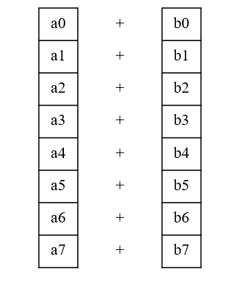
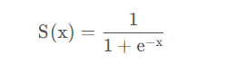
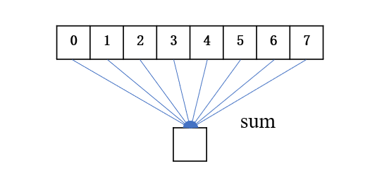
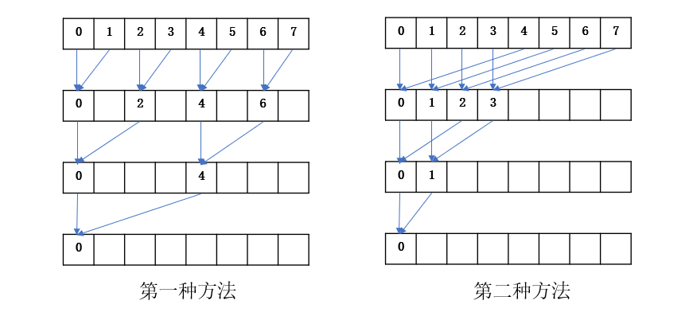
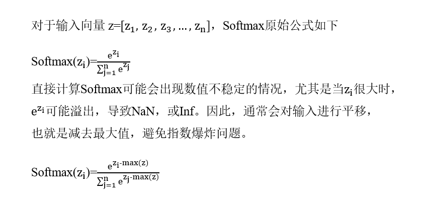
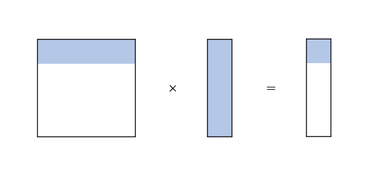
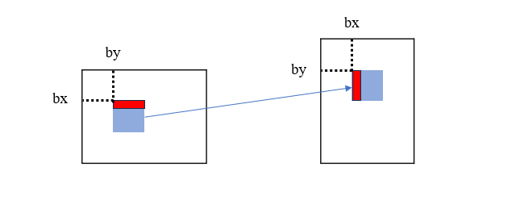
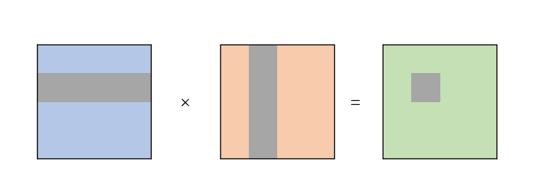
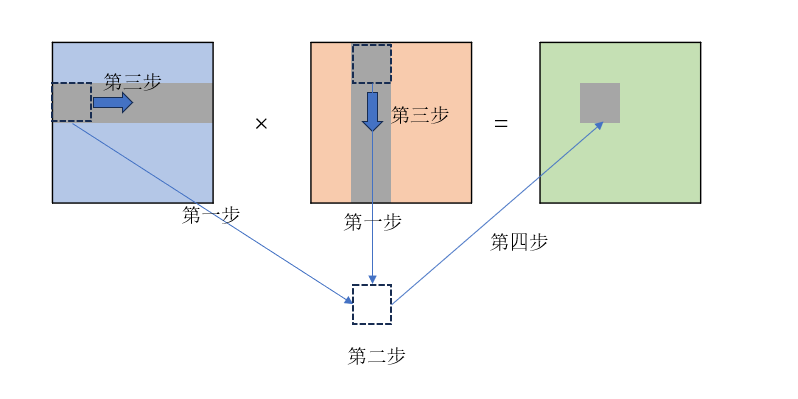

# 常见的CUDA算子

**项目地址:**[nands6/cuda_kernel: 关于cuda算子的一些优化实现](https://github.com/nands6/cuda_kernel)

# 项目介绍

下面是一些常见的算子以及代码实现，包括原始实现以及相关的一些优化版本实现

| 算子      | 描述                           |
| --------- | ------------------------------ |
| Add       | 向量加                         |
| ReLU      | 激活函数                       |
| Sigmoid   | 激活函数                       |
| Reduce    | 规约，包括最大值和求和         |
| SoftMax   | 激活函数，用于多分类问题的输出 |
| Gemv      | 矩阵向量乘法                   |
| Transpose | 矩阵转置                       |
| Gemm      | 矩阵乘法                       |

# 1.elementwise

elementwise指的是逐元素进行操作，最常见包括向量的加法减法，以及ReLU和Sigmoid激活函数。

Add,ReLU,Sigmod这些都是是访存密集型算子，计算强度低。即使优化良好，性能仍受限于GPU显存带宽

## 1.1 Add

向量加法

### naive版本

一个线程处理一个元素，对于长度为n的向量，需要n个线程

~~~c++
dim3 block(32);
dim3 grid((n+block-1)/block);
gpu_addV1<<<grid,block>>>(d_a,d_b,d_c,n);

__global__ void gpu_addV1(float *a,float *b,float *c,int n){
    int tx=threadIdx.x+blockDim.x*blockIdx.x;
    if(tx<n){
        c[tx]=a[tx]+b[tx];
    }
}
~~~

### 增加每个线程的工作量

暂时先不使用向量化，让一个线程处理thread_per_num个数据。

这样一个线程块能够处理blockDim.x*thread_per_num个数据，所以GRID的数量需要除以4。

~~~c++
const int thread_per_num=4;
dim3 block(32);
dim3 grid((n+block-1)/block/thread_per_num);
gpu_addV2<thread_per_num><<<grid,block>>>(d_a,d_b,d_c,n);

template <int thread_per_num>
__global__ void gpu_addV2(float *a,float *b,float *c,int n){
    int tx=(threadIdx.x+blockDim.x*blockIdx.x)*thread_per_num;
    if(tx<n){
        for(int i=0;i<thread_per_num;i++){
            c[tx+i]=a[tx+i]+b[tx+i];
        }
    }
}
~~~

### 向量化版本

通过float4向量化访存方式，使得一个线程可以同时处理4个数据。

~~~c++
dim3 block(32);
dim3 grid((n+block-1)/block/thread_per_num/4);
gpu_addV3<<<grid,block>>>(d_a,d_b,d_c,n);

#define FETCH_FLOAT4(value) (reinterpret_cast<float4 *>(&(value))[0])
__global__ void gpu_addV3(float *a,float *b,float *c,int n){
    int tx=(threadIdx.x+blockDim.x*blockIdx.x)*4;
    float4 tmp_a,tmp_b,tmp_c;
    if(tx<n){
        tmp_a=FETCH_FLOAT4(a[tx]);
        tmp_b=FETCH_FLOAT4(b[tx]);
        tmp_c.x=tmp_a.x+tmp_b.x;
        tmp_c.y=tmp_a.y+tmp_b.y;
        tmp_c.z=tmp_a.z+tmp_b.z;
        tmp_c.w=tmp_a.w+tmp_b.w;
        FETCH_FLOAT4(c[tx])=tmp_c;
    }
}
~~~

## 1.2 ReLU

ReLU是神经网络中常用的一种激活函数，当输入x>0时，输出等于输入；当输入x<=0时，输出为0。

### naive版本

一个线程处理一个元素，对于长度为n的向量，需要n个线程。

~~~c++
dim3 block(32);
dim3 grid((n+block-1)/block);
gpu_reluV1<<<grid,block>>>(d_a,d_b,n);

__global__ void gpu_reluV1(float *a,float *b,int n){
    int tx=blockDim.x*blockIdx.x+threadIdx.x;
    if(tx<n){
        b[tx]=fmaxf(0,a[tx]);
    }
}
~~~

### 增加每个线程的工作量

暂时先不使用向量化，让一个线程处理thread_per_num个数据。

这样一个线程块能够处理blockDim.x*thread_per_num个数据，所以GRID的数量需要除以4。

~~~c++
const int thread_per_num=4;
dim3 block(32);
dim3 grid((n+block-1)/block/thread_per_num);
gpu_reluV2<thread_per_num><<<grid,block>>>(d_a,d_b,n);

template <int thread_per_num>
__global__ void gpu_reluV2(float *a,float *b,int n){
    int tx=(threadIdx.x+blockDim.x*blockIdx.x)*thread_per_num;
    if(tx<n){
        for(int i=0;i<thread_per_num;i++){
            b[tx+i]=fmaxf(0,a[tx+i]);
        }
    }
}
~~~

### 向量化版本

通过float4向量化访存方式，使得一个线程可以同时处理4个数据。

~~~c++
dim3 block(32);
dim3 grid((n+block-1)/block/thread_per_num/4);
gpu_reluV3<<<grid,block>>>(d_a,d_b,n);

#define FETCH_FLOAT4(value) (reinterpret_cast<float4 *>(&(value))[0])
__global__ void gpu_reluV3(float *a,float *b,int n){
    int tx=(threadIdx.x+blockDim.x*blockIdx.x)*4;
    float4 tmp_a,tmp_b;
    if(tx<n){
        tmp_a=FETCH_FLOAT4(a[tx]);
        tmp_b.x=fmaxf(0,tmp_a.x);
        tmp_b.y=fmaxf(0,tmp_a.y);
        tmp_b.z=fmaxf(0,tmp_a.z);
        tmp_b.w=fmaxf(0,tmp_a.w);
        FETCH_FLOAT4(b[tx])=tmp_b;
    }
}
~~~

## 1.3 Sigmoid

Sigmoid也是神经网络中常用的一种激活函数，用于隐层神经单位输出，取值范围为（0,1），可以将一个实数映射到（0,1）的区间。

### naive版本

一个线程处理一个元素，对于长度为n的向量，需要n个线程。

~~~c++
dim3 block(32);
dim3 grid((n+block-1)/block);
gpu_sigmoidV1<<<grid,block>>>(d_a,d_b,n);

__global__ void gpu_sigmoidV1(float *a,float *b,int n){
    int tx=blockDim.x*blockIdx.x+threadIdx.x;
    if(tx<n){
        b[tx]=1/(1+expf(-a[tx]));
    }
}
~~~

### 增加每个线程的工作量

暂时先不使用向量化，让一个线程处理thread_per_num个数据。

这样一个线程块能够处理blockDim.x*thread_per_num个数据，所以GRID的数量需要除以4。

~~~c++
const int thread_per_num=4;
dim3 block(32);
dim3 grid((n+block-1)/block/thread_per_num);
gpu_sigmoidV2<thread_per_num><<<grid,block>>>(d_a,d_b,n);

template <int thread_per_num>
template <int thread_per_num>
__global__ void gpu_sigmoidV2(float *a,float *b,int n){
    int tx=(threadIdx.x+blockDim.x*blockIdx.x)*thread_per_num;
    if(tx<n){
        for(int i=0;i<thread_per_num;i++){
            b[tx+i]=1/(1+expf(-a[tx+i]));
        }
    }
}

~~~

### 向量化版本

通过float4向量化访存方式，使得一个线程可以同时处理4个数据。

~~~c++
dim3 block(32);
dim3 grid((n+block-1)/block/thread_per_num/4);
gpu_sigmoidV3<<<grid,block>>>(d_a,d_b,n);

#define FETCH_FLOAT4(value) (reinterpret_cast<float4 *>(&(value))[0])
__global__ void gpu_sigmoidV3(float *a,float *b,int n){
    int tx=(threadIdx.x+blockDim.x*blockIdx.x)*4;
    float4 tmp_a,tmp_b;
    if(tx<n){
        tmp_a=FETCH_FLOAT4(a[tx]);
        tmp_b.x=1/(1+expf(-tmp_a.x));
        tmp_b.y=1/(1+expf(-tmp_a.y));
        tmp_b.z=1/(1+expf(-tmp_a.z));
        tmp_b.w=1/(1+expf(-tmp_a.w));
        FETCH_FLOAT4(b[tx])=tmp_b;
    }
}
~~~

# 2.Reduce

Reduce规约算子用于将一个数组中的元素通过某种运算（如求和、最大值、最小值等）归约为一个值。

如图所示，naive版本都是通过CUDA原子操作实现。

在并行计算中，多个线程同时更新同一个数据会导致数据之间的竞争，导致结果不一致。为此，CUDA引入了原子操作，保障共享数据在并发访问时的正确性与高效性。

**常见的一些原子操作**

| 操作   | 函数                 |                    |
| :----- | -------------------- | ------------------ |
| 加法   | atomicAdd(addr, val) | 加                 |
| 减法   | atomicSub(addr, val) | 减                 |
| 最大值 | atomicMax(addr, val) | 返回两个值的最大值 |
| 最小值 | atomicMin(addr, val) | 返回两个值的最小值 |

## 2.1 Reduce_Sum

规约求和。

### naive版本

每个线程都通过` atomicAdd`往同一个内存中写入数据。

原子操作会导致线程变成序列化，丧失并行性，因此，一般情况下不会使用原子函数，后续版本会说明。

~~~c++
dim3 block(32);  
dim3 grid((n+block-1)/block);
reduce_naive<<<grid, block>>>(d_a, d_b, n);
 
__global__ void reduce_naive(const float* a, float* b, int n) {
    int tx = blockDim.x * blockIdx.x + threadIdx.x;
    if (tx < n){
        atomicAdd(b, a[n]);
    } 
}
~~~

### 线程块内折半规约

每一个线程块规约自己块内的数据，最后会剩`gridDim.x`个数据。

这些数据可以再通过一次规约计算，例如

~~~c++
reduce<<<grid,block>>>();
reduce<<<1,grid>>>();
~~~

我们采用第二种方法实现，但是还是给出了两种方法的代码。

第一种方法会出现严重的warp divergence。并且第二种方法还能避免Bank conflict。

一个 warp的线程共享同一个指令，当一个 warp 中的线程因为if-else而需要执行不同指令路径时，就会发生warp divergence。

比如说我们使用256个线程，那么会有8个warp，那么第一种方法就会导致每个warp只有16个线程执行。而第二种方法是只有前四个warp执行，后四个warp不执行。

~~~c++
dim3 block(64);  
dim3 grid((n+block-1)/block);
reduce_sumV1<<<grid,block>>>(d_a,d_b);
reduce_sumV2<<<grid,block>>>(d_a,d_b);

//第一种方法 只有偶数线程执行
__global__ void reduce_sumV1(float* input,float *output){
    int tx=threadIdx.x;
    extern __shared__ float shared[];
    float *begin_input=input+blockDim.x*blockIdx.x;
    shared[tx]=begin_input[tx];
    __syncthreads();

    for(int i=1;i<blockDim.x;i=i*2){
        if(tx%(i*2)==0){
            shared[tx]+=shared[tx+i];
        }
        __syncthreads();
    }
    if(tx==0){
        output[blockIdx.x]=shared[tx];
    }

}
//第二种方法   前blockDim.x/2个线程执行
__global__ void reduce_sumV2(float* input,float *output){
    int tx=threadIdx.x;
    extern __shared__ float shared[];
    
    float *begin_input=input+blockDim.x*blockIdx.x;
    shared[tx]=begin_input[tx];
    __syncthreads();
    for(int i=blockDim.x/2;i>0;i=i/2){
        if(tx<i){
            shared[tx]+=shared[tx+i];
        }
        __syncthreads();
    }

    if(tx==0){
        output[blockIdx.x]=shared[tx];
    }

}
~~~

### warp shuffle内规约

通过线程块进行规约会出现大量的同步`__syncthreads();`操作。

在warp内规约，由于一个 warp 内的线程是同步的，所以不需要`__syncthreads()`操作。

~~~c++
__device__ float warpreduceSum(float val){
    
    for(int i=16;i>0;i=i/2){
        val=val+__shfl_down_sync(0xffffffff,val,i);
    }
    return val;
}
__global__ void reduce_sumV3(float* input,float *output){
    int tx=blockDim.x*blockIdx.x+threadIdx.x;
    int warpnum=blockDim.x/32;
    int warpid=threadIdx.x/32;
    int laneid=threadIdx.x%32;
    extern __shared__ float shared[];

    float sum=input[tx];
    sum=warpreduceSum(sum);
    //for(int i=16;i>0;i=i/2){
    //    sum+=__shfl_down_sync(0xffffffff,sum,i);
    //}
    if(laneid==0){
        shared[warpid]=sum;
    }
    __syncthreads();

    if(warpid==0){
        if(laneid<warpnum){
            sum=shared[laneid];
        }else{
            sum=0;
        }
        sum=warpreduceSum(sum);
        //for(int i=16;i>0;i=i/2){
        //    sum+=__shfl_down_sync(0xffffffff,sum,i);
        //}
    }
    if(threadIdx.x==0){
       output[blockIdx.x]=sum;
    }
}
~~~

这段代码使用了两次warp内的规约。

第二次是让第一个warp对所有warp的结果再进行一次规约。

一个线程块最多只能有32个warp，也就是说第一次规约完成之后，最多只有32个数据，该代码对于不足32个数据时，会对后续的数据补为0，然后再从16进行规约。其实直接从warpnum/2开始__shfl_down_sync就可以了。

## 2.2 Reduce_Max

规约求最大值。这部分与Reduce_Sum是相同的思路。直接给出warp shuffle内规约的版本。

### warp shuffle内规约

~~~c++
__device__ float warpreduceMax(float val){
    
    for(int i=16;i>0;i=i/2){
        val=fmaxf(val,__shfl_down_sync(0xffffffff,val,i));
    }
    return val;
}
__global__ void reduce_maxV3(float* input,float *output){
    int tx=blockDim.x*blockIdx.x+threadIdx.x;
    int warpnum=blockDim.x/32;
    int warpid=threadIdx.x/32;
    int laneid=threadIdx.x%32;
    extern __shared__ float shared[];

    float max=input[tx];
    max=warpreduceMax(max);
    // for(int i=16;i>0;i=i/2){
    //     max=fmax(max,__shfl_down_sync(0xffffffff,max,i));
    // }
    if(laneid==0){
        shared[warpid]=max;
    }
    __syncthreads();

    if(warpid==0){
        if(laneid<warpnum){
            max=shared[laneid];
        }else{
            max=-INFINITY;
        }
        max=warpreduceMax(max);
        // for(int i=16;i>0;i=i/2){
        //     max=fmaxf(max,__shfl_down_sync(0xffffffff,max,i));
        // }
    }

    if(threadIdx.x==0){
        output[blockIdx.x]=max;
    }

}
~~~

# 3.Softmax

所以Softmax一般就是先规约求最大值，然后再求和，但是相比于reduce，Softmax是一个N*C的矩阵，一行指定一个线程块，一个需要N个线程块。

### naive版本

一共N个线程块，一个线程块包含一个线程。

~~~c++
dim3 block(1);
dim3 grid(N);
gpu_softmaxV1<<<grid,block>>>(device_inp,device_out,N,C);

__global__ void gpu_softmaxV1(float *inp,float *out,int N,int C){
    
    float *begin_inp=inp+blockIdx.x*C;
    float *begin_out=out+blockIdx.x*C;
    float max=-INFINITY;
    
    for(int i=0;i<C;i++){
        if(begin_inp[i]>max){
            max=begin_inp[i];
        }
    }
    float sum=0;
    for(int i=0;i<C;i++){
        begin_out[i]=expf(begin_inp[i]-max);
        sum=sum+begin_out[i];
    }
    for(int i=0;i<C;i++){
        begin_out[i]=begin_out[i]/sum;
    }

}
~~~

### 一个线程处理多个元素

一共N个线程块，一个线程块包含32、64、128……线程。

~~~c++
dim3 block(64);
dim3 grid(N);
const int block_size=block;
gpu_softmaxV2<block_size><<<grid,block>>>(device_inp,device_out,N,C);

template<int BLOCK>
__global__ void gpu_softmaxV2(float *inp,float *out,int N,int C){
    float *begin_inp=inp+blockIdx.x*C;
    float *begin_out=out+blockIdx.x*C;
    __shared__ float shared[BLOCK];
    // extern __shared__ float shared[];

    float max=-INFINITY;
    for(int i=threadIdx.x;i<C;i=i+blockDim.x){
        max=fmaxf(max,begin_inp[i]);
    }    
    shared[threadIdx.x]=max;
    __syncthreads();
    
    for(int i=blockDim.x/2;i>0;i=i/2){
        if(threadIdx.x<i){
            shared[threadIdx.x]=fmaxf(shared[threadIdx.x],shared[threadIdx.x+i]);
        }
        __syncthreads();
    }
    __syncthreads();
    max=shared[0];
   
    float sum=0;
    for(int i=threadIdx.x;i<C;i=i+blockDim.x){
        begin_out[i]=expf(begin_out[i]-max);
        sum=sum+begin_out[i];
    }    
    shared[threadIdx.x]=sum;
    __syncthreads();

    for(int i=blockDim.x/2;i>0;i=i/2){
        if(threadIdx.x<i){
            shared[threadIdx.x]=shared[threadIdx.x]+shared[threadIdx.x+i];
        }
        __syncthreads();
    }
    __syncthreads();
    sum=shared[0];

    for(int i=threadIdx.x;i<C;i=i+blockDim.x){
        begin_out[i]=begin_out[i]/sum;
    }    
}
~~~

### warp shuffle

在warp内规约，规约完成之后让第一个warp对同一个线程块的warp值再进行一次规约。

~~~c++
dim3 block(64);
dim3 grid(N);
gpu_softmaxV3<<<grid,block>>>(device_inp,device_out,N,C);

__device__ float warpreduceMax(float val){
    
    for(int i=16;i>0;i=i/2){
        val=fmaxf(val,__shfl_down_sync(0xffffffff,val,i));
    }
    return val;
}
__device__ float warpreduceSum(float val){
    
    for(int i=16;i>0;i=i/2){
        val=val+__shfl_down_sync(0xffffffff,val,i);
    }
    return val;
}
__global__ void gpu_softmaxV3(float *inp,float *out,int N,int C){
    float *begin_inp=inp+blockIdx.x*C;
    float *begin_out=out+blockIdx.x*C;
    int warpnum=blockDim.x/32;
    int warpid=threadIdx.x/32;
    int laneid=threadIdx.x%32;
    extern __shared__ float shared[];

    float max=-INFINITY;
    for(int i=threadIdx.x;i<C;i=i+blockDim.x){
        max=fmaxf(max,begin_inp[i]);
    }    
    __syncthreads();
    max=warpreduceMax(max);
    // for(int i=16;i>0;i=i/2){
    //     max=fmaxf(max,__shfl_down_sync(0xffffffff,max,i));
    // }
    if(laneid==0){
        shared[warpid]=max;
    }
    __syncthreads();
    
    if(warpid==0){
        if(laneid<warpnum){
            max=shared[laneid];
        }else{
            max=-INFINITY;
        }
        max=warpreduceMax(max);
        // for(int i=16;i>0;i=i/2){
        //     max=fmaxf(max,__shfl_down_sync(0xffffffff,max,i));
        // }
        shared[0]=max;
    }
    __syncthreads();
    max=shared[0];
    
    float sum=0;
    for(int i=threadIdx.x;i<C;i=i+blockDim.x){
        begin_out[i]=expf(begin_inp[i]-max);
        sum=sum+begin_out[i];
    }
    __syncthreads();
    sum=warpreduceSum(sum);
    // for(int i=16;i>0;i=i/2){
    //     sum=sum+__shfl_down_sync(0xffffffff,sum,i);
    // }
    if(laneid==0){
        shared[warpid]=sum;
    }
    __syncthreads();
    if(warpid==0){
        if(laneid<warpnum){
            sum=shared[laneid];
        }else{
            sum=0;
        }
        sum=warpreduceSum(sum);
        // for(int i=16;i>0;i=i/2){
        //     sum=sum+__shfl_down_sync(0xffffffff,sum,i);
        // }
        shared[0]=sum;
    }
    __syncthreads();
    sum=shared[0];

    for(int i=threadIdx.x;i<C;i=i+blockDim.x){
        begin_out[i]=begin_out[i]/sum;
    }

}
~~~

# 4.Gemv

Gemv是一个m*n的稠密矩阵乘一个n\*1列向量。

### naive版本

使用m个线程块，一个线程块包含一个线程，一个线程处理一行数据。

~~~c++
dim3 block(1);
dim3 grid(m);
gpu_gemvV1<<<grid,block>>>(device_a,device_b,device_c,m,n);

__global__ void gpu_gemvV1(float *a,float *b,float *c,int m,int n){
    float *begin_a=a+blockIdx.x*n;
    float sum=0;
    for(int i=0;i<n;i++){
        sum+=begin_a[i]*b[i];
    }
    c[blockIdx.x]=sum;
    
}
~~~

### 一个线程处理多个数据

~~~c++
dim3 block(64);
dim3 grid(m);
gpu_gemvV2<<<grid_size,block_size>>>(device_a,device_b,device_c,m,n);

__global__ void gpu_gemvV2(float *a,float *b,float *c,int m,int n){
    int tx=threadIdx.x;
    extern __shared__ float shared[];
    float *begin_a=a+blockIdx.x*n;
    float sum=0;
    for(int i=tx;i<n;i=i+blockDim.x){
        sum=sum+begin_a[i]*b[i];
    }
    shared[tx]=sum;
    __syncthreads();
    for(int i=blockDim.x/2;i>0;i=i/2){
        if(tx<i){
            shared[tx]+=shared[tx+i];
        }
        __syncthreads();
    }
    sum=shared[0];
    if(threadIdx.x==0){
        c[blockIdx.x]=sum;
    }
}
~~~

### warp shuffle

~~~c++
dim3 block(64);
dim3 grid(m);
gpu_gemvV3<<<grid_size,block_size>>>(device_a,device_b,device_c,m,n);

__global__ void gpu_gemvV3(float *a,float *b,float *c,int m,int n){
    int tx=threadIdx.x;
    int warpnum=blockDim.x/32;
    int warpid=threadIdx.x/32;
    int laneid=threadIdx.x%32;
    extern __shared__ float shared[];
    float *begin_a=a+blockIdx.x*n;
    float sum=0;
    for(int i=tx;i<n;i=i+blockDim.x){
        sum=sum+begin_a[i]*b[i];
    }
    // shared[tx]=sum;
    __syncthreads();
    for(int i=16;i>0;i=i/2){
        sum=sum+__shfl_down_sync(0xffffffff,sum,i);
    }
    if(laneid==0){
        shared[warpid]=sum;
    }
    __syncthreads();
    //单个线程规约每个warp的值
    // float tmp=0;
    // if(threadIdx.x==0){
    //     for(int i=0;i<warpnum;i++){
    //         tmp=tmp+shared[i];
    //     }
    // }
    // __syncthreads();
    // if(threadIdx.x==0){
    //     c[blockIdx.x]=tmp;
    // }
    
    //让第一个warp继续规约所有warp的值,相较于Reduce和Softmax,这次从warpnum开始
    if(warpid==0){
        sum=shared[laneid];
        for(int i=warpnum/2;i>0;i=i/2){
            sum=sum+__shfl_down_sync(0xffffffff,sum,i);
        }
    }
    __syncthreads();
    if(threadIdx.x==0){
        c[blockIdx.x]=sum;
    }
}
~~~

# 5.transpose

将一个m*n的矩阵转置成n\*m的矩阵。

### naive版本

一个线程处理一个数据。

~~~c++
dim3 block(32,32);
dim3 grid((n+block.x-1)/block.x,(m+block.y-1)/block.y);
gpu_transeposeV1<<<grid,block>>>(device_a,device_b,m,n);

__global__ void gpu_transeposeV1(float *inp,float *out,int m,int n){
    
    int tx=blockDim.x*blockIdx.x+threadIdx.x;
    int ty=blockDim.y*blockIdx.y+threadIdx.y;
    if(tx<n&&ty<m){
        // out[tx*m+ty]=inp[ty*n+tx];   //读取是合并访问的，但是写入不是
        out[ty*m+tx]=inp[tx*n+ty];   //写入是合并访问的，但是读取不是
        // out[ty*m+tx]=__ldg(&inp[tx*n+ty]);  //与第二个一样，目前的架构一般不需要__ldg,因为能够自动判断并优化
    }
}

~~~

如何优化全局内存的访问：

1. **尽量合并访问**，即连续的线程读取连续的内存，且尽量让访问的全局内存的首地址是32字节（一次数据传输处理的数据量）的倍数（cudaMalloc分配的至少是256字节整数倍）；
2. 如果不能同时合并读取和写入，则应该**尽量做到合并写入**，因为编译器如果能判断一个全局内存变量在核函数内是只可读的，会自动调用 `__ldg()` 读取全局内存，从而对数据进行缓存，缓解非合并访问带来的影响，但这只对读取有效，写入则没有类似的函数。另外，对于开普勒架构和麦克斯韦架构，需要显式的使用 `__ldg()` 函数，例如 `B[ny * N + nx] = __ldg(&A[nx * N + ny])`。

**如果不能同时合并读取和写入，则应该尽量做到合并写入**。这是因为：

1.读取有缓存优化：编译器可自动使用 `__ldg()` 或通过L1/L2缓存优化非合并读取

2.写入无类似优化：写入操作必须直接访问全局内存，非合并写入代价更高

​	开普勒(Kepler)和麦克斯韦(Maxwell)架构：需要显式使用。帕斯卡(Pascal)及之后：编译器可自动判断并优化。因此目前的架构一般都不需要__ldg(),因为它能够自动优化。

### 共享内存

将一个线程块处理的输入矩阵数据先放入共享内存中，然后通过共享内存放入到输出矩阵。

~~~c++
dim3 block(32,32);
dim3 grid((n+block.x-1)/block.x,(m+block.y-1)/block.y);
gpu_transeposeV2<32><<<grid,block>>>(device_a,device_b,m,n);

template<int BLOCK>
__global__ void gpu_transeposeV2(float *inp,float *out,int m,int n){
    __shared__ float shared[BLOCK][BLOCK];
    int bx=blockDim.x*blockIdx.x;
    int by=blockDim.y*blockIdx.y;

    int tx=threadIdx.x+bx;
    int ty=threadIdx.y+by;
    float *begin_inp=inp+by*n+bx;
    if(tx<n&&ty<m){
        shared[threadIdx.y][threadIdx.x]=begin_inp[threadIdx.y*n+threadIdx.x];
    }
    __syncthreads();

    int tx2=by+threadIdx.x;
    int ty2=bx+threadIdx.y;
    float *begin_out=out+bx*m+by;
    if(tx2<m&&ty2<n){
        begin_out[threadIdx.y*m+threadIdx.x]=shared[threadIdx.x][threadIdx.y];
    }

}
~~~

# 6.Gemm

一个m*k的矩阵乘一个k\*n的矩阵，得到一个m\*n的矩阵。

### naive版本

一个线程处理一个数据，且从全局内存从读取和写入数据。

每个元素从全局内存中加载多次，访存压力大。

~~~c++
dim3 block(16,16);
dim3 grid((n+block.x-1)/block.x,(m+block.y-1)/block.y);
gpu_gemmV1<<<grid,block>>>(device_a,device_b,device_c,m,n,k);

__global__ void gpu_gemmV1(float *a,float *b,float *c,int m,int n,int k){
    int bx=blockDim.x*blockIdx.x;
    int by=blockDim.y*blockIdx.y;
    int tx=bx+threadIdx.x;
    int ty=by+threadIdx.y;

    if(tx<n&&ty<m){
        float sum=0;
        for(int i=0;i<k;i++){
            sum+=a[ty*k+i]*b[i*n+tx];
        }
        c[ty*n+tx]=sum;
    }

}
~~~

### 共享内存+滑动窗口

对于C中BM*BN大小的线程块。

A中块的大小为BM\*BK，B中的为BK\*BN，首先计算这两个块的矩阵乘积，存放到tmp中。然后A中的窗口沿着X轴移动，B中的窗口沿着Y轴移动，继续计算下一次的乘积，累加到tmp中。最后，等到A和B的窗口完成，将tmp的值放到C中。

~~~c++
const int BM=16;
const int BN=16;
const int BK=16;
dim3 block(16,16);
dim3 grid((n+block.x-1)/block.x,(m+block.y-1)/block.y);
gpu_gemmV2<BM,BN,BK><<<grid,block>>>(device_a,device_b,device_c,m,n,k);

template<int BM,int BN,int BK>
__global__ void gpu_gemmV2(float *a,float *b,float *c,int m,int n,int k){
    int bx=blockDim.x*blockIdx.x;
    int by=blockDim.y*blockIdx.y;
    int tx=bx+threadIdx.x;
    int ty=by+threadIdx.y;
    __shared__ float a_shared[BM][BK];
    __shared__ float b_shared[BK][BN];
    float *begin_c=c+by*n+bx;
    float *begin_a=a+by*k;
    float *begin_b=b+bx;
    float sum=0;
    if(tx<n&&ty<m){
        for(int s=0;s<k;s=s+BK){
            a_shared[threadIdx.y][threadIdx.x]=begin_a[threadIdx.y*k+s+threadIdx.x];  //a[ty*n+i+threadIdx.x]
            b_shared[threadIdx.y][threadIdx.x]=begin_b[s*n+threadIdx.y*n+threadIdx.x];
            __syncthreads();
            for(int i=0;i<BK;i++){
                sum=sum+a_shared[threadIdx.y][i]*b_shared[i][threadIdx.x];
            }
            __syncthreads();
        }
        begin_c[threadIdx.y*n+threadIdx.x]=sum;
    }
}
~~~

### 增加线程工作量

让一个线程处理X轴上的STRIDE个数据和Y轴上的STRIDE数据。

~~~c++
const int BM=16;
const int BN=16;
const int BK=16;
const int STRIDE=2;
dim3 block(16,16);
dim3 grid((n+block.x-1)/block.x/STRIDE,(m+block.y-1)/block.y/STRIDE);
gpu_gemmV3<BM,BN,BK,STRIDE><<<grid,block>>>(device_a,device_b,device_c,m,n,k);

template<int BM,int BN,int BK,int STRIDE>
__global__ void gpu_gemmV3(float *a,float *b,float *c,int m,int n,int k){
    int STEP=blockDim.x*STRIDE;
    int bx=STEP*blockIdx.x;
    int by=STEP*blockIdx.y;
    int tx=threadIdx.x;
    int ty=threadIdx.y;
    float *begin_c=c+by*n+bx;
    float *begin_a=a+by*k;
    float *begin_b=b+bx;
    float tmp[STRIDE][STRIDE]={0};
    __shared__ float a_shared[BM*STRIDE][BK*STRIDE];
    __shared__ float b_shared[BK*STRIDE][BN*STRIDE];

    for(int s=0;s<k;s=s+STEP){
        for(int i=0;i<STRIDE;i++){
            for(int j=0;j<STRIDE;j++){
                a_shared[ty+i*blockDim.y][tx+j*blockDim.x]=begin_a[ty*k+i*blockDim.y*k+tx+j*blockDim.x+s];
                b_shared[ty+i*blockDim.y][tx+j*blockDim.x]=begin_b[n*(ty+s+i*blockDim.y)+tx+j*blockDim.x];
            }
        }
        __syncthreads();
        for(int i=0;i<STRIDE;i++){
            for(int j=0;j<STRIDE;j++){
                for(int x=0;x<STEP;x++){
                    tmp[i][j]+=a_shared[ty+i*blockDim.y][x]*b_shared[x][tx+j*blockDim.x];
                }
                
            }
        }
        __syncthreads();
    }
    
    for(int i=0;i<STRIDE;i++){
        for(int j=0;j<STRIDE;j++){
            begin_c[ty*n+i*blockDim.y*n+tx+j*blockDim.x]=tmp[i][j];
        }
    }

}
~~~

### FLOAT4向量化版本

~~~c++
dim3 block(8,32)
dim3 grid((n+block.x-1)/block.x/4,(m+block.y-1)/block.y);
const BM=32
const BN=32
const BK=32
constexpr int NUM_PER_THREAD = 4;
gpu_gemmv4<M_NUM_PER_BLOCK, N_NUM_PER_BLOCK,K_NUM_PER_BLOCK,NUM_PER_THREAD>
    <<<grid, block>>>(device_A, device_B, device_C, m, n, k);

#define FETCH_float4(pointer) (reinterpret_cast<float4 *>(&(pointer))[0])
template <int BM,int BN,int BK,int  NUM_PER_THREAD>
__global__ void gpu_gemmv4(float *A, float *B, float *C, int m, int n, int k)
{
    int tx=threadIdx.x;
    int ty=threadIdx.y;
    float *begin_A=A+blockIdx.y*k*BM;
    float *begin_B=B+blockIdx.x*BN;
    __shared__ float a_shared[BM][BK];
    __shared__ float b_shared[BK][BN];

    float temp[NUM_PER_THREAD]={0};
    

    for(int s=0;s<k;s=s+BK){
        FETCH_float4(a_shared[ty][tx*NUM_PER_THREAD])= FETCH_float4(begin_A[ty*k+tx*NUM_PER_THREAD+s]);
        // a_shared[ty][tx*NUM_PER_THREAD]=begin_A[ty*k+tx*NUM_PER_THREAD+s];
        // a_shared[ty][tx*NUM_PER_THREAD+1]=begin_A[ty*k+tx*NUM_PER_THREAD+s+1];
        // a_shared[ty][tx*NUM_PER_THREAD+2]=begin_A[ty*k+tx*NUM_PER_THREAD+s+2];
        // a_shared[ty][tx*NUM_PER_THREAD+3]=begin_A[ty*k+tx*NUM_PER_THREAD+s+3];
        FETCH_float4(b_shared[ty][tx*NUM_PER_THREAD])= FETCH_float4(begin_B[ty*n+s*n+tx*NUM_PER_THREAD]);
        // b_shared[ty][tx*NUM_PER_THREAD]=begin_B[ty*n+s*n+tx*NUM_PER_THREAD];
        // b_shared[ty][tx*NUM_PER_THREAD+1]=begin_B[ty*n+s*n+tx*NUM_PER_THREAD+1];
        // b_shared[ty][tx*NUM_PER_THREAD+2]=begin_B[ty*n+s*n+tx*NUM_PER_THREAD+2];
        // b_shared[ty][tx*NUM_PER_THREAD+3]=begin_B[ty*n+s*n+tx*NUM_PER_THREAD+3];
        __syncthreads();
  
        for(int i=0;i<NUM_PER_THREAD;i++){
            #pragma unroll
            for(int j=0;j<BK;j++){
                temp[i]+=a_shared[ty][j]*b_shared[j][tx*NUM_PER_THREAD+i];
            }
        }
        __syncthreads();
    }

    float *begin_C=C+blockIdx.y*BM*n+blockIdx.x*BN;

    for(int i=0;i<NUM_PER_THREAD;i++){
        begin_C[ty*n+tx*NUM_PER_THREAD+i]=temp[i];
    }

}
~~~

# 相关文章

1.[(1 封私信) CUDA算子手撕与面试 - 知乎](https://zhuanlan.zhihu.com/p/12661298743)

2.[Liu-xiandong/How_to_optimize_in_GPU: This is a series of GPU optimization topics. Here we will introduce how to optimize the CUDA kernel in detail. I will introduce several basic kernel optimizations, including: elementwise, reduce, sgemv, sgemm, etc. The performance of these kernels is basically at or near the theoretical limit.](https://github.com/Liu-xiandong/How_to_optimize_in_GPU)

3.[比飞鸟贵重的多_HKL的个人空间-比飞鸟贵重的多_HKL个人主页-哔哩哔哩视频](https://space.bilibili.com/218427631/lists/4695308?type=series)

关于BLOCK的选择

1.[[CUDA 学习笔记\] CUDA kernel 的 grid_size 和 block_size 选择_下列哪些是核函数的执行配置-CSDN博客](https://blog.csdn.net/LostUnravel/article/details/135721041)